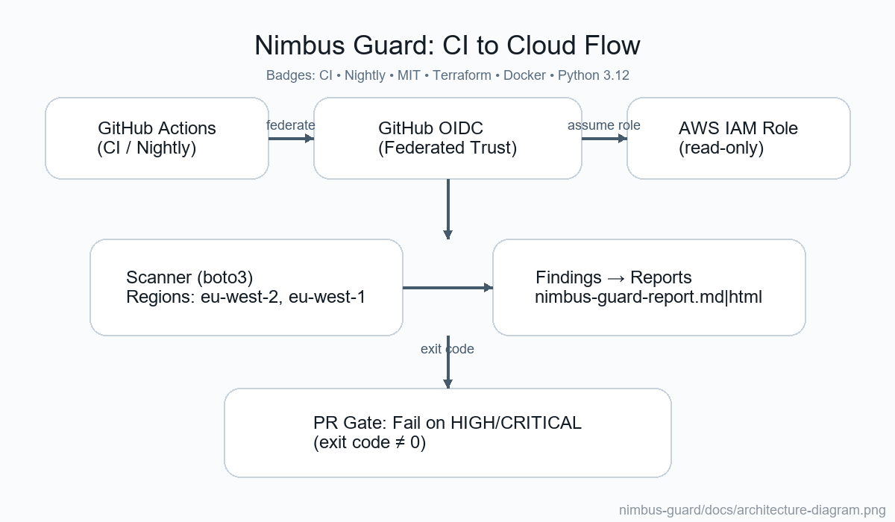
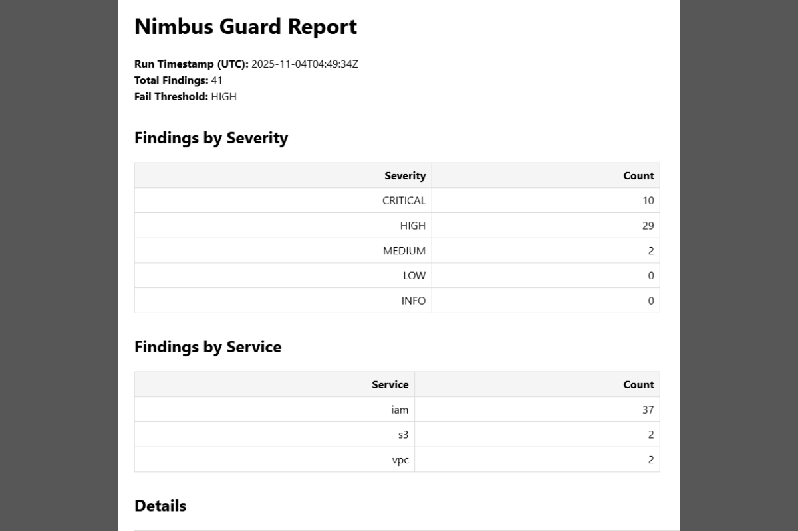
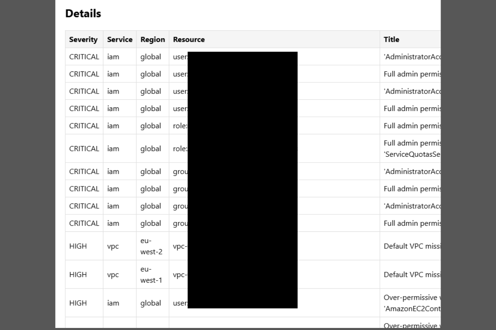
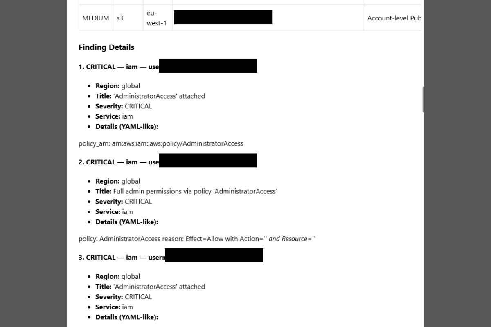

# 📘 Nimbus Guard - Documentation

This directory contains **architectural references**, **sample output reports**, and the **delivery playbook** for the Nimbus Guard project; a multi‑region AWS security scanner designed for automated compliance, misconfiguration detection, and CI/CD enforcement.

---

## 🏗️ System Architecture

The following diagram illustrates the **end‑to‑end architecture** of Nimbus Guard, highlighting CI/CD integration via GitHub Actions OIDC, AWS role assumption, and multi‑region scanning workflows.

  

**Flow Summary:**  
1️⃣ GitHub Actions initiates the scan using an OIDC‑assumed AWS role.  
2️⃣ The scanner (Python + boto3) enumerates resources across multiple AWS regions.  
3️⃣ Findings are aggregated, templated, and output as Markdown/HTML reports.  
4️⃣ Exit codes bubble to CI to enforce fail‑on‑severity policies.  

---

## 🧾 Sample Report Output

Below is a **visual walkthrough** of a Nimbus Guard security scan report, presented in three panels for readability.

### 🧩 Report Part 1 — Summary & Severity Overview

  

---

### 🧩 Report Part 2 — Findings by Service (S3, IAM, Security Groups)

  

---

### 🧩 Report Part 3 — CloudTrail / Account / VPC Insights

  

---

## 🧭 Additional Resources

| File | Description |
|------|--------------|
| **[DELIVERY_PLAYBOOK.md](./DELIVERY_PLAYBOOK.md)** | Detailed breakdown of each project phase (0–5), handoff notes, and demo instructions |
| **architecture-diagram.png** | Core architectural overview |
| **sample_report_p1‑3.png** | Example visual reports for presentation and documentation |

---

> **Maintained by:** Asad; Cloud Engineer w/ AWS & Terraform | Specialising in Statistics, Data & Security
